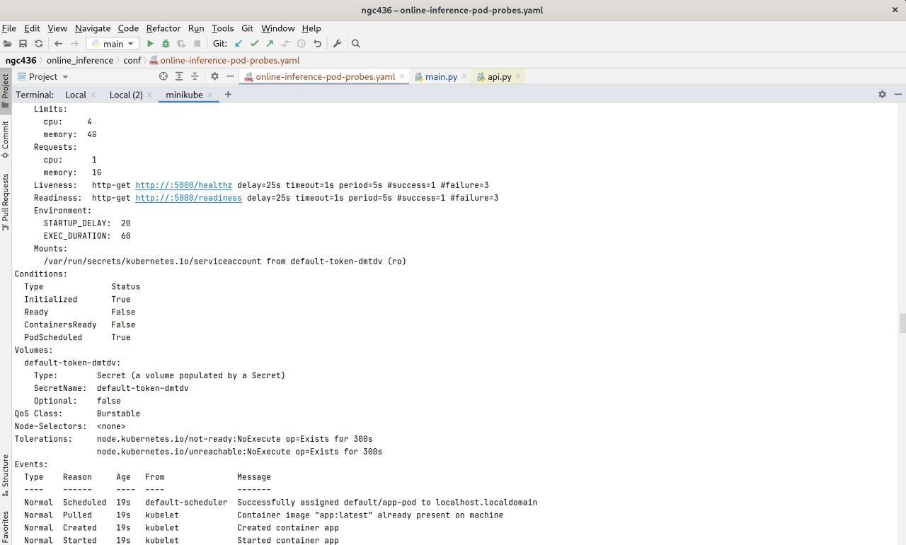
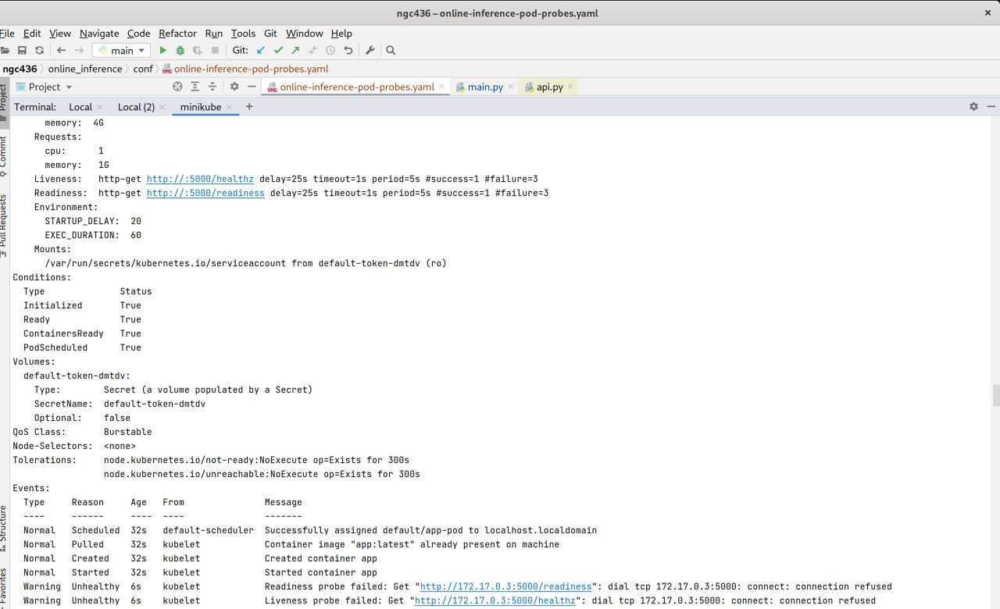
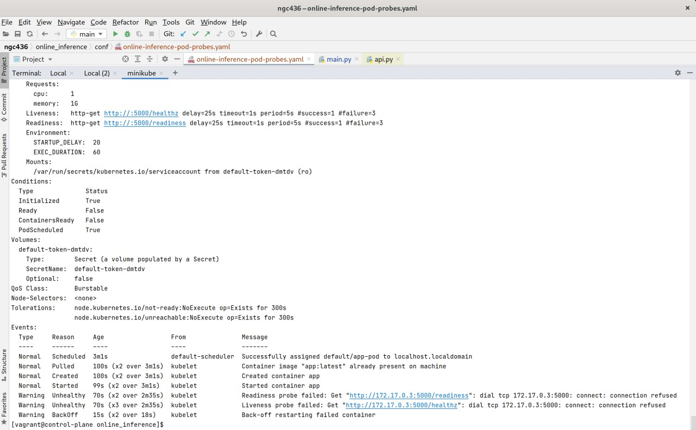
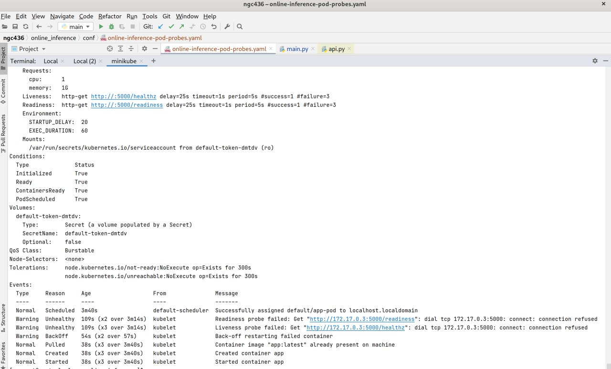

1) kubernetes был развернут на minikube (5 баллов)    
   
2) Скрин поднятого кластера  (4 балла)  
  
   
2a) Для выставления нижних и верхних границ потребляемого ресурса используются limits и request соответственно. (2 балла)  

3) Readiness позволяет понять при старте готов ли контейнер и стоит ли посылать к нему запросы. Liveness проверяет в рабочем ли состоянии контейнер в текцщий момент. (3 балла)   
  
  
     
     
   
Код публикации приложения лежит в ./bin/build-docker.sh   

4) При уменьшении числа реплик и одновременно изменении образа, старый образ остается у старых инстансов. При увеличении числа инстансов новые инстансы идут уже с новым образом а у старых остается старый.  (3 балла)   

5) Подготовлены манифесты деплоя. (3 балла)  

Самооценка (1 балл)  
Итого: 21  